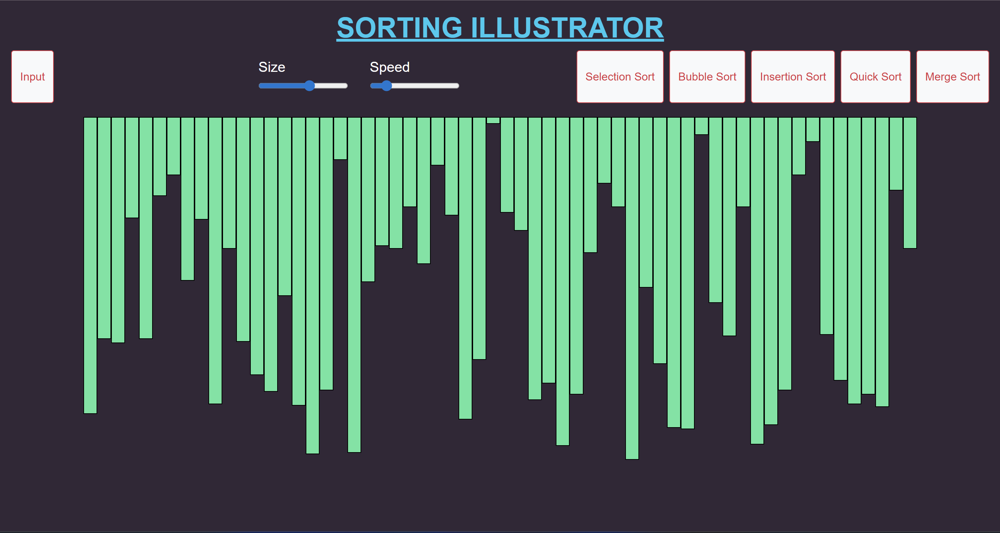

# Sorting Visualiser 🎨📊

A simple and interactive web-based sorting algorithm visualizer built with **HTML**, **CSS**, and **JavaScript**. This project demonstrates how various sorting algorithms work through real-time animations.

## 📸 Preview




## 🔍 Features

- Visualizes popular sorting algorithms:
  - Bubble Sort
  - Selection Sort
  - Insertion Sort
  - Merge Sort
  - Quick Sort
- Adjustable array size and speed of visualization
- Generate new arrays instantly
- Clean and responsive UI

## 🚀 Demo

🔗 [Live Demo](https://sriramsatvik-dev.github.io/Sorting_Visualiser/) *(Enable JavaScript in your browser to view the visualization)*


## 🛠️ Tech Stack

- HTML5
- CSS3
- JavaScript (ES6)

## 📂 Project Structure
Sorting_Visualiser/

├── assets 
|         └── demo.png
|
├── Javascript_files 
|                   ├── bubble_sort.js
|                   ├── insertion_sort.js
|                   ├── merge_sort.js
|                   ├── quick_sort.js
|                   ├── selection_sort.js
|                   └── sorting.js
|
├── index.html
├── README.md
└── style.css


## 🧠 How It Works

Each bar represents an array element. When a sorting algorithm is selected, the bars are rearranged visually to demonstrate how that algorithm processes and sorts the data.

Algorithms work by:
- Comparing array elements
- Swapping/moving values
- Repeating steps until the array is sorted

<!-- ## 🧪 How to Use

1. Clone the repository:
   ```bash
    git clone https://github.com/SriramSatvik-dev/Sorting_Visualiser.git
2. Open index.html in your browser.
3. Choose a sorting algorithm and click "Start".
 -->
